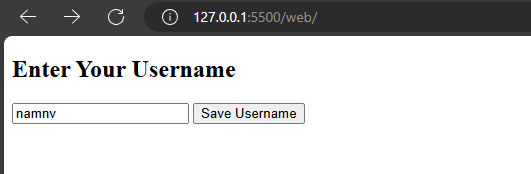
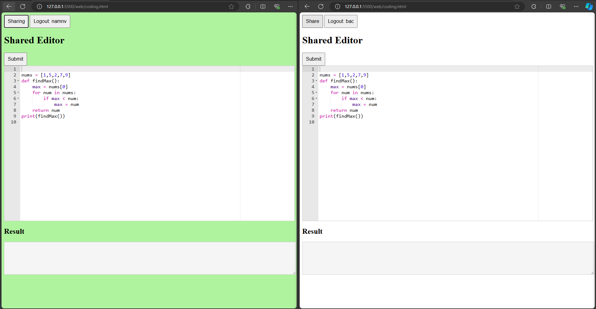
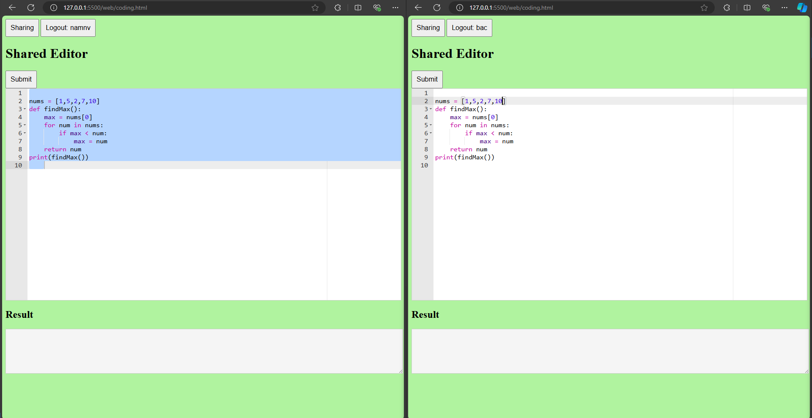
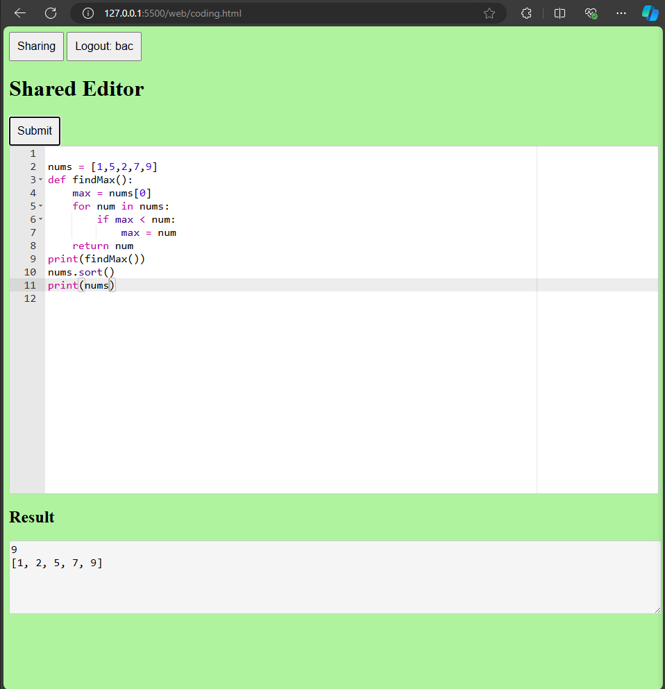

# IDE pair for interview

- realtime update typing
- support run code

# How to run

- Start docker
- run cmd `go run main.go`
- start FE `cd web` and `start index.html` 

# Demonstration

Input name

Click to button `Share` after that the backgound color change to green

Now If you edit in editor of any user, the changing will apply for all user

Click run button to run code

